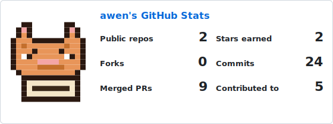
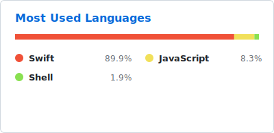
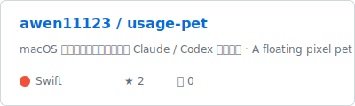
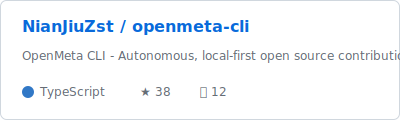
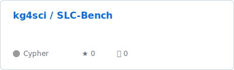
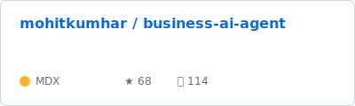
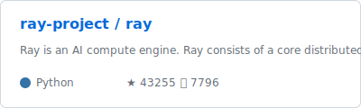
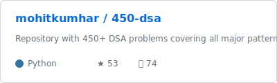

## Hey there 👋, I'm [awen!](https://github.com/awen11123/)

### Glad to see you here! 🐱

I build small, useful things — mostly **macOS apps** and **AI tooling**. My latest is [usage-pet](https://github.com/awen11123/usage-pet), a pixel pet that lives on your desktop and shows how much of your Claude / Codex usage budget is left.

I like things that are **a little playful**, **a little useful**, and **work offline**. Open source is how I learn, so you'll find me sending small PRs into projects I use.

### Talking about Personal Stuff:

- 🛠 &nbsp; Currently building with **Swift**, **TypeScript**, and **Python**
- 🚀 &nbsp; Currently exploring **Claude Agent SDK** and **macOS menu-bar apps**
- 🐱 &nbsp; Mascot: a pixel orange tabby (see the cards below 👇)
- 👾 &nbsp; Fun fact: the cat on my stats card is hand-drawn pixel by pixel in SVG
- 📫 &nbsp; Reach me by opening an [issue here](https://github.com/awen11123/awen11123/issues)

### Languages and Tools:

<code></code>
<code></code>
<code></code>
<code></code>
<code></code>
<code></code>
<code></code>

### Projects and Dev Stuffs:

  
<b>⚡ GitHub Stats</b>

   
  
  

  
<b>☄️ GitHub Streak</b>

   
  

### ✨ Featured Project

  

### 🐍 Watch a snake eat my contributions

<picture>
  <source media="(prefers-color-scheme: dark)" srcset="https://raw.githubusercontent.com/awen11123/awen11123/output/snake-dark.svg" />
  <source media="(prefers-color-scheme: light)" srcset="https://raw.githubusercontent.com/awen11123/awen11123/output/snake.svg" />
  
</picture>

### 🌱 Open Source Contributions

Repositories I've contributed merged PRs to, refreshed daily by GitHub Actions.

<!-- CONTRIBUTIONS:START -->

> Auto-generated daily. Last updated: 2026-06-10

 <b>3</b> merged · latest: <a href="https://github.com/NianJiuZst/openmeta-cli/pull/51">#51</a>

 <b>2</b> merged · latest: <a href="https://github.com/kg4sci/SLC-Bench/pull/2">#2</a>

 <b>2</b> merged · latest: <a href="https://github.com/mohitkumhar/business-ai-agent/pull/756">#756</a>

 <b>1</b> merged · latest: <a href="https://github.com/ray-project/ray/pull/63872">#63872</a>

 <b>1</b> merged · latest: <a href="https://github.com/mohitkumhar/450-dsa/pull/731">#731</a>

<!-- CONTRIBUTIONS:END -->

#

### Show some ❤️ by starring projects you like!

All cards are SVGs generated by <a href="scripts/generate-cards.mjs"><code>scripts/generate-cards.mjs</code></a> — no external image services, no rate limits.

